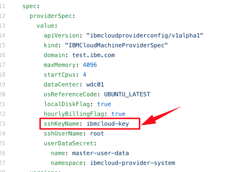
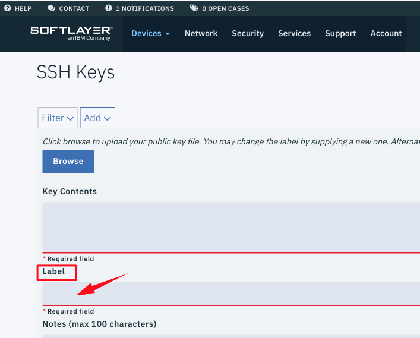

[](https://travis-ci.org/kubernetes-sigs/cluster-api-provider-ibmcloud)
[](https://goreportcard.com/report/sigs.k8s.io/cluster-api-provider-ibmcloud)
[](https://github.com/kubernetes-sigs/cluster-api-provider-ibmcloud/blob/master/LICENSE)
[](https://github.com/kubernetes-sigs/cluster-api-provider-ibmcloud/releases "Cluster API provider IBM Cloud latest release")

<!-- START doctoc generated TOC please keep comment here to allow auto update -->
<!-- DON'T EDIT THIS SECTION, INSTEAD RE-RUN doctoc TO UPDATE -->
**Table of Contents**  *generated with [DocToc](https://github.com/thlorenz/doctoc)*

- [Kubernetes Cluster API Provider IBM Cloud](#kubernetes-cluster-api-provider-ibm-cloud)
  - [What is the Cluster API Provider IBM Cloud](#what-is-the-cluster-api-provider-ibm-cloud)
  - [Community, discussion, contribution, and support](#community-discussion-contribution-and-support)
    - [Code of conduct](#code-of-conduct)
  - [Getting Started](#getting-started)
    - [Prerequisites](#prerequisites)
    - [Cluster Creation](#cluster-creation)
    - [Interacting with your cluster](#interacting-with-your-cluster)
    - [Cluster Deletion](#cluster-deletion)
    - [Create additional worker nodes](#create-additional-worker-nodes)
    - [How to use clusterctl image](#how-to-use-clusterctl-image)
    - [Troubleshooting](#troubleshooting)
  - [IBM Cloud References](#ibm-cloud-references)

<!-- END doctoc generated TOC please keep comment here to allow auto update -->

# Kubernetes Cluster API Provider IBM Cloud

<a href="https://github.com/kubernetes-sigs/cluster-api"></a><a href="https://www.ibm.com/cloud/"></a>

------

This repository hosts a concrete implementation of an IBM Cloud provider for the [cluster-api project](https://github.com/kubernetes-sigs/cluster-api).

## What is the Cluster API Provider IBM Cloud

The [Cluster API](https://github.com/kubernetes-sigs/cluster-api) brings declarative, Kubernetes-style APIs to cluster creation, configuration and management. The API itself is shared across multiple cloud providers allowing for true IBM Cloud hybrid deployments of Kubernetes.

## Community, discussion, contribution, and support

Learn how to engage with the Kubernetes community on the [community page](http://kubernetes.io/community/).

You can reach the maintainers of this project at:

- [#provider-ibmcloud on Kubernetes Slack](https://kubernetes.slack.com/messages/provider-ibmcloud)
- [SIG-Cluster-Lifecycle Mailing List](https://groups.google.com/forum/#!forum/kubernetes-sig-cluster-lifecycle)

### Code of conduct

Participation in the Kubernetes community is governed by the [Kubernetes Code of Conduct](code-of-conduct.md).

------

## Getting Started

### Prerequisites

1. Install `kubectl` (see [here](https://kubernetes.io/docs/tasks/tools/install-kubectl/#install-kubectl-binary-with-curl-on-linux)). Because `kustomize` was included into `kubectl` and it's used by `cluster-api-provider-ibmcloud` in generating yaml files, so version `1.14.0+` of `kubectl` is required, see [integrate kustomize into kubectl](https://github.com/kubernetes/enhancements/issues/633) for more info.
2. You can use either VM, container or existing Kubernetes cluster act as the bootstrap cluster.
   - If you want to use container, install [kind](https://github.com/kubernetes-sigs/kind#installation-and-usage). This is preferred.
   - If you want to use VM, install [minikube](https://kubernetes.io/docs/tasks/tools/install-minikube/), version 0.30.0 or greater.
   - If you want to use existing Kubernetes cluster, prepare your kubeconfig.
3. Install a [driver](https://github.com/kubernetes/minikube/blob/master/docs/drivers.md) **if you are using minikube**. For Linux, we recommend kvm2. For MacOS, we recommend VirtualBox.
4. An appropriately configured [Go development environment](https://golang.org/doc/install)
5. Build the `clusterctl` tool

   ```bash
   git clone https://github.com/kubernetes-sigs/cluster-api-provider-ibmcloud $GOPATH/src/sigs.k8s.io/cluster-api-provider-ibmcloud
   cd $GOPATH/src/sigs.k8s.io/cluster-api-provider-ibmcloud/cmd/clusterctl
   go build
   ```

### Cluster Creation

1. Create the `cluster.yaml`, `machines.yaml`, `provider-components.yaml`, and `addons.yaml` files if needed.

   ```bash
   cd examples/ibmcloud
   ./generate-yaml.sh [options] <path/to/clouds.yaml> <provider os: [centos,ubuntu,coreos]>
   cd ../..
   ```

   `<clouds.yaml>` is a yaml file to record how to interact with IBM Cloud, there's a sample
   [clouds.yaml](cmd/clusterctl/examples/ibmcloud/clouds.yaml.template).

   `<provider os>` specifies the operating system of the virtual machines Kubernetes will run on.
   Supported Operating Systems:
   - `ubuntu`
   - `centos` (Not Implemented)
   - `coreos` (Not Implemented)

   Example command:

   ```bash
   ./generate-yaml.sh ./clouds.yaml ubuntu
   ```

   #### Quick notes on clouds.yaml
   ```shell
   $ cat clouds.yaml
   clouds:
    ibmcloud:
      auth:
        apiUserName: "Your API Username"
        authenticationKey: "Your API Authentication Key"
   ```

   You can get `apiUserName` and `authenticationKey` from [IBM Cloud CLI](https://cloud.ibm.com/docs/cli?topic=cli-getting-started).
   - Login to IBM Cloud with your account
   ```shell
   $ ibmcloud login
   ```
   - List user accounts to get an account for IBM Cloud operation
   ```shell
   $ ibmcloud sl user list
   id        username                     email                displayName
   xxxxxxx   your_user_name@email.example name@email.example   Your_Name
   ```
   - Get user details with your `id`
   ```shell
   $ ibmcloud sl user detail your_id --keys
   name           value
   ...
   Username       your_user_name@email.example
   APIKEY         fakekey001
   ...
   ```
   You got `Username` and `APIKEY` to configure `apiUserName` and `authenticationKey` of your `clouds.yaml`

   #### Special notes on SSH keys and fetching `admin.conf`

   In order to allow `clusterctl` to fetch Kubernetes' `admin.conf` from the master node, you **must** manually create the SSH key in IBM Cloud. By default the generated `machine.yaml` uses `cluster-api-provider-ibmcloud` to be the `sshKeyName`. However, you are free to change that.

   For the SSH key, you can logon to https://control.softlayer.com/ , click `Devices->Manage->SSH Keys`, you will be navigated to the page of `SSH Keys`, click `Add` to create your own key.
   
   

   ***NOTE*** The private key used to connect to the master node is by default at `~/.ssh/id_ibmcloud`. It is generated by `generate-yaml.sh` if related keys do not exist in your environment.
   Please make sure the content of the corresponding public key file `~/.ssh/id_ibmcloud.pub` is used in creating your IBM Cloud SSH key. Environment variable `IBMCLOUD_HOST_SSH_PRIVATE_FILE` is supported to customize SSH key file, set this value before you run `generate-yaml.sh` and `clusterctl` to modify default SSH key file.

   For the `sshUserName`, you can use `root` or `ubuntu` user for the `Ubuntu` cloud image, while you can only use `root` user for other Linux cloud images. By default the generated `machine.yaml` uses `root` to be the `sshUserName`.

   Optionally, add a `addons.yaml` can provide additional add ons in target cluster, for example, download [k8s dashboard](https://raw.githubusercontent.com/kubernetes/dashboard/master/aio/deploy/recommended/kubernetes-dashboard.yaml) to `examples/ibmcloud/out/` directory:

   ```bash
   wget -O  addons.yaml  https://raw.githubusercontent.com/kubernetes/dashboard/master/aio/deploy/recommended/kubernetes-dashboard.yaml
   ```

   Add `-a examples/ibmcloud/out/addons.yaml` in `clusterctl` command, after cluster created. The dashboard pod will be created and user is able to logon through k8s dashboard:

   ```
   # kubectl --kubeconfig=kubeconfig get pods --all-namespaces
   NAMESPACE                  NAME                                          READY   STATUS             RESTARTS   AGE
   ...
   kube-system                kubernetes-dashboard-5f7b999d65-ntrxb         1/1     Running            0          12m
   ...
   ```

2. Create a cluster:

You should review files `cluster.yaml` and `machines.yaml`, and ensure the `domain`, `dataCenter` and `osReferenceCode` are set. You can customize those values based on your requirement.

For `machines.yaml`, you can follow the [sample file](https://github.com/kubernetes-sigs/cluster-api-provider-ibmcloud/blob/master/examples/ubuntu/machines.yaml), and make sure `sshKeyName` and the `Label` value in `SSH Keys` are identical, shown as below:




   - If you are using minikube:

   ```bash
   ./clusterctl create cluster --bootstrap-type minikube --bootstrap-flags kubernetes-version=v1.12.3 \
     --provider ibmcloud -c examples/ibmcloud/out/cluster.yaml \
     -m examples/ibmcloud/out/machines.yaml -p examples/ibmcloud/out/provider-components.yaml \
     -a examples/ibmcloud/out/addons.yaml
   ```

   To choose a specific minikube driver, please use the `--bootstrap-flags vm-driver=xxx` command line parameter. For example to use the kvm2 driver with clusterctl you woud add `--bootstrap-flags vm-driver=kvm2`, for linux, if you haven't installed any driver, you can add `--bootstrap-flags vm-driver=none`.

   - If you are using kind:

   ```bash
   ./clusterctl create cluster --bootstrap-type kind --provider ibmcloud \
     -c examples/ibmcloud/out/cluster.yaml -m examples/ibmcloud/out/machines.yaml \
     -p examples/ibmcloud/out/provider-components.yaml -a examples/ibmcloud/out/addons.yaml
   ```

   **NOTE:** If you have an existing Kubernetes cluster which is created by kind, and the cluster name is `clusterapi`,  you should delete this cluster before run `clusterctl` to create a cluster, for example:

   ```
   # kind get clusters
   clusterapi
   # kind delete cluster --name=clusterapi
   Deleting cluster "clusterapi" ...
   ```

   - If you are using existing Kubernetes cluster:
   ```bash
   ./clusterctl create cluster --bootstrap-cluster-kubeconfig ~/.kube/config \
     --provider ibmcloud -c examples/ibmcloud/out/cluster.yaml \
     -m examples/ibmcloud/out/machines.yaml -p examples/ibmcloud/out/provider-components.yaml \
     -a examples/ibmcloud/out/addons.yaml
   ```

   For the above command, the `bootstrap-cluster-kubeconfig` was located at `~/.kube/config`, you must update it
   to use your kubeconfig.

   Additional advanced flags can be found via help.

   ```bash
   ./clusterctl create cluster --help
   ```

### Interacting with your cluster

If you are using kind, config the `KUBECONFIG` first before using kubectl:

```bash
export KUBECONFIG="$(kind get kubeconfig-path --name="clusterapi")"
```

Once you have created a cluster, you can interact with the cluster and machine
resources using kubectl:

```
# kubectl --kubeconfig=kubeconfig get clusters
NAME    AGE
test1   28m
# kubectl --kubeconfig=kubeconfig get machines
NAME                    PROVIDERID              PHASE
ibmcloud-master-464lh   ibmcloud:////82692207   Running
ibmcloud-node-rjtnv     ibmcloud:////82692501   Running
# kubectl --kubeconfig=kubeconfig get machines -o yaml
apiVersion: v1
items:
- apiVersion: cluster.k8s.io/v1alpha1
  kind: Machine
  metadata:
    annotations:
      ibmcloud-ip-address: 158.85.27.183
    creationTimestamp: "2019-06-15T15:56:16Z"
    finalizers:
    - foregroundDeletion
    - machine.cluster.k8s.io
    generateName: ibmcloud-master-
    generation: 1
    labels:
      cluster.k8s.io/cluster-name: test1
...
```

### Cluster Deletion

This guide explains how to delete all resources that were created as part of
your IBM Cloud Cluster API Kubernetes cluster.

1. Delete all of the node Machines in the cluster. Make sure to wait for the
  corresponding Nodes to be deleted before moving onto the next step. After this
  step, the master node will be the only remaining node.

   ```bash
   kubectl --kubeconfig=kubeconfig delete machines -l set=node
   kubectl --kubeconfig=kubeconfig get nodes
   ```

2. Delete the master machine.
    ```bash
    kubectl --kubeconfig=kubeconfig delete machines -l set=master
    ```

3. Delete the kubeconfig file that were created for your cluster.

   ```bash
   rm kubeconfig
   ```

4. Delete the SSH key pair that were created for your cluster machine.

   ```bash
   rm -rf $HOME/.ssh/id_ibmcloud*
   ```

### Create additional worker nodes

Please refer to [Create a new worker node](docs/add_node.md) for further info.

### How to use clusterctl image

The `quay.io/cluster-api-provider-ibmcloud/clusterctl` image is designed to run independently to provision ibmcloud cluster. We have embedded the `kind` and `kubectl` into `clusterctl` image. Please refer to [How to use clusterctl image](docs/how_to_use_clusterctl.md) for further info.

### Troubleshooting

Please refer to [Troubleshooting documentation](docs/troubleshooting.md) for further info.

## IBM Cloud References

If you have any further question about IBM Cloud settings in provider, please refer to
[IBM Cloud help documentation](docs/ibmcloud_help.md) for further information.
