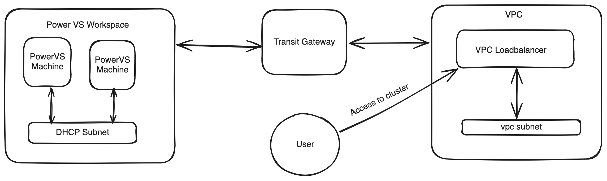
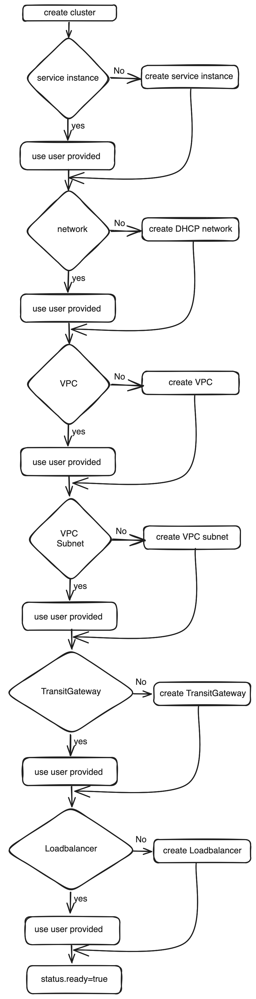
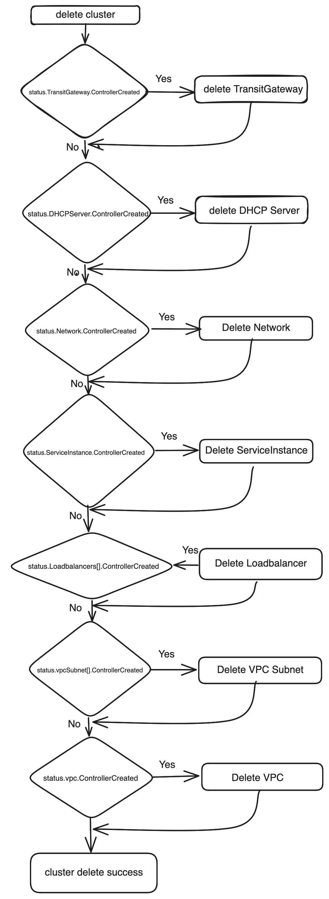

# Dynamically create infrastructure required for PowerVS cluster

## Motivation
Currently, inorder to create  a PowerVS cluster using cluster api we need to create few resources as prerequisites which includes -
1. Creating a PowerVS workspace
2. Creating a PowerVS Network
3. Creating a port on network

As this involves some prerequisite work which is limiting the true capabilities of cluster api.
Along the similar line today the cluster is accessible to end user via external ip and which is loadbalanced on controlplanes using kube-vip.

## Goal
1. Dynamically create the required cloud resources as a part of cluster creation.
2. Allow users to access the cluster via loadbalancer.

## Proposal

### Cluster API PowerVS cluster components



PowerVS workpsace is connected to IBM Cloud VPC with the help of IBM Cloud TransitGateway.

### Proposed API changes

```shell
// IBMPowerVSClusterSpec defines the desired state of IBMPowerVSCluster.
type IBMPowerVSClusterSpec struct {
	// ServiceInstanceID is the id of the power cloud instance where the vsi instance will get deployed.
	// Deprecated: use ServiceInstance instead
	ServiceInstanceID string `json:"serviceInstanceID"`

	// Network is the reference to the Network to use for this cluster.
	// when the field is omitted, A DHCP service will be created in the Power VS workspace and its private network will be used.
	// the DHCP service created network will have the following name format
	// 1. in the case of DHCPServer.Name is not set the name will be DHCPSERVER<CLUSTER_NAME>_Private.
	// 2. if DHCPServer.Name is set the name will be DHCPSERVER<DHCPServer.Name>_Private.
	// when Network.ID is set, its expected that there exist a network in PowerVS workspace with id or else system will give error.
	// when Network.Name is set, system will first check for network with Name in PowerVS workspace, if not exist network will be created by DHCP service.
	// Network.RegEx is not yet supported and system will ignore the value.
	Network IBMPowerVSResourceReference `json:"network"`

	// dhcpServer is contains the configuration to be used while creating a new DHCP server in PowerVS workspace.
	// when the field is omitted, CLUSTER_NAME will be used as DHCPServer.Name and DHCP server will be created.
	// it will automatically create network with name DHCPSERVER<DHCPServer.Name>_Private in PowerVS workspace.
	// +optional
	DHCPServer *DHCPServer `json:"dhcpServer,omitempty"`

	// ControlPlaneEndpoint represents the endpoint used to communicate with the control plane.
	// +optional
	ControlPlaneEndpoint capiv1beta1.APIEndpoint `json:"controlPlaneEndpoint"`

	// serviceInstance is the reference to the Power VS server workspace on which the server instance(VM) will be created.
	// Power VS server workspace is a container for all Power VS instances at a specific geographic region.
	// serviceInstance can be created via IBM Cloud catalog or CLI.
	// supported serviceInstance identifier in PowerVSResource are Name and ID and that can be obtained from IBM Cloud UI or IBM Cloud cli.
	// More detail about Power VS service instance.
	// https://cloud.ibm.com/docs/power-iaas?topic=power-iaas-creating-power-virtual-server
	// when omitted system will dynamically create the service instance with name CLUSTER_NAME-serviceInstance.
	// when ServiceInstance.ID is set, its expected that there exist a service instance in PowerVS workspace with id or else system will give error.
	// when ServiceInstance.Name is set, system will first check for service instance with Name in PowerVS workspace, if not exist system will create new instance.
	// ServiceInstance.Regex is not yet supported not yet supported and system will ignore the value.
	// +optional
	ServiceInstance *IBMPowerVSResourceReference `json:"serviceInstance,omitempty"`

	// zone is the name of Power VS zone where the cluster will be created
	// possible values can be found here https://cloud.ibm.com/docs/power-iaas?topic=power-iaas-creating-power-virtual-server.
	// when powervs.cluster.x-k8s.io/create-infra=true annotation is set on IBMPowerVSCluster resource,
	// 1. it is expected to set the zone, not setting will result in webhook error.
	// 2. the zone should have PER capabilities, or else system will give error.
	// +optional
	Zone *string `json:"zone,omitempty"`

	// resourceGroup name under which the resources will be created.
	// when powervs.cluster.x-k8s.io/create-infra=true annotation is set on IBMPowerVSCluster resource,
	// 1. it is expected to set the ResourceGroup.Name, not setting will result in webhook error.
	// ServiceInstance.ID and ServiceInstance.Regex is not yet supported and system will ignore the value.
	// +optional
	ResourceGroup *IBMPowerVSResourceReference `json:"resourceGroup,omitempty"`

	// vpc contains information about IBM Cloud VPC resources.
	// when omitted system will dynamically create the VPC with name CLUSTER_NAME-vpc.
	// when VPC.ID is set, its expected that there exist a VPC with ID or else system will give error.
	// when VPC.Name is set, system will first check for VPC with Name, if not exist system will create new VPC.
	// when powervs.cluster.x-k8s.io/create-infra=true annotation is set on IBMPowerVSCluster resource,
	// 1. it is expected to set the VPC.Region, not setting will result in webhook error.
	// +optional
	VPC *VPCResourceReference `json:"vpc,omitempty"`

	// vpcSubnets contains information about IBM Cloud VPC Subnet resources.
	// when omitted system will create the subnets in all the zone corresponding to VPC.Region, with name CLUSTER_NAME-vpcsubnet-ZONE_NAME.
	// possible values can be found here https://cloud.ibm.com/docs/power-iaas?topic=power-iaas-creating-power-virtual-server.
	// when VPCSubnets[].ID is set, its expected that there exist a subnet with ID or else system will give error.
	// when VPCSubnets[].Zone is not set, a random zone is picked from available zones of VPC.Region.
	// when VPCSubnets[].Name is not set, system will set name as CLUSTER_NAME-vpcsubnet-INDEX.
	// if subnet with name VPCSubnets[].Name not found, system will create new subnet in VPCSubnets[].Zone.
	// +optional
	VPCSubnets []Subnet `json:"vpcSubnets,omitempty"`

	// transitGateway contains information about IBM Cloud TransitGateway
	// IBM Cloud TransitGateway helps in establishing network connectivity between IBM Cloud Power VS and VPC infrastructure
	// more information about TransitGateway can be found here https://www.ibm.com/products/transit-gateway.
	// when TransitGateway.ID is set, its expected that there exist a TransitGateway with ID or else system will give error.
	// when TransitGateway.Name is set, system will first check for TransitGateway with Name, if not exist system will create new TransitGateway.
	// +optional
	TransitGateway *TransitGateway `json:"transitGateway,omitempty"`

	// loadBalancers is optional configuration for configuring loadbalancers to control plane or data plane nodes.
	// when omitted system will create a public loadbalancer with name CLUSTER_NAME-loadbalancer.
	// when specified a vpc loadbalancer will be created and controlPlaneEndpoint will be set with associated hostname of loadbalancer.
	// ControlPlaneEndpoint will be set with associated hostname of public loadbalancer.
	// when LoadBalancers[].ID is set, its expected that there exist a loadbalancer with ID or else system will give error.
	// when LoadBalancers[].Name is set, system will first check for loadbalancer with Name, if not exist system will create new loadbalancer.
	// +optional
	LoadBalancers []VPCLoadBalancerSpec `json:"loadBalancers,omitempty"`

	// cosInstance contains options to configure a supporting IBM Cloud COS bucket for this
	// cluster - currently used for nodes requiring Ignition
	// (https://coreos.github.io/ignition/) for bootstrapping (requires
	// BootstrapFormatIgnition feature flag to be enabled).
	// when powervs.cluster.x-k8s.io/create-infra=true annotation is set on IBMPowerVSCluster resource and Ignition is set, then
	// 1. CosInstance.Name should be set not setting will result in webhook error.
	// 2. CosInstance.BucketName should be set not setting will result in webhook error.
	// 3. CosInstance.BucketRegion should be set not setting will result in webhook error.
	// +optional
	CosInstance *CosInstance `json:"cosInstance,omitempty"`

	// Ignition defined options related to the bootstrapping systems where Ignition is used.
	// +optional
	Ignition *Ignition `json:"ignition,omitempty"`
}

// Ignition defines options related to the bootstrapping systems where Ignition is used.
type Ignition struct {
	// Version defines which version of Ignition will be used to generate bootstrap data.
	//
	// +optional
	// +kubebuilder:default="2.3"
	// +kubebuilder:validation:Enum="2.3";"2.4";"3.0";"3.1";"3.2";"3.3";"3.4"
	Version string `json:"version,omitempty"`
}

// IBMPowerVSClusterStatus defines the observed state of IBMPowerVSCluster.
type IBMPowerVSClusterStatus struct {
	// ready is true when the provider resource is ready.
	// +kubebuilder:default=false
	Ready bool `json:"ready"`

	// ResourceGroup is the reference to the Power VS resource group under which the resources will be created.
	ResourceGroup *ResourceReference `json:"resourceGroupID,omitempty"`

	// serviceInstance is the reference to the Power VS service on which the server instance(VM) will be created.
	ServiceInstance *ResourceReference `json:"serviceInstance,omitempty"`

	// networkID is the reference to the Power VS network to use for this cluster.
	Network *ResourceReference `json:"network,omitempty"`

	// dhcpServer is the reference to the Power VS DHCP server.
	DHCPServer *ResourceReference `json:"dhcpServer,omitempty"`

	// vpc is reference to IBM Cloud VPC resources.
	VPC *ResourceReference `json:"vpc,omitempty"`

	// vpcSubnet is reference to IBM Cloud VPC subnet.
	VPCSubnet map[string]ResourceReference `json:"vpcSubnet,omitempty"`

	// transitGateway is reference to IBM Cloud TransitGateway.
	TransitGateway *ResourceReference `json:"transitGateway,omitempty"`

	// cosInstance is reference to IBM Cloud COS Instance resource.
	COSInstance *ResourceReference `json:"cosInstance,omitempty"`

	// loadBalancers reference to IBM Cloud VPC Loadbalancer.
	LoadBalancers map[string]VPCLoadBalancerStatus `json:"loadBalancers,omitempty"`

	// Conditions defines current service state of the IBMPowerVSCluster.
	Conditions capiv1beta1.Conditions `json:"conditions,omitempty"`
}

// DHCPServer contains the DHCP server configurations.
type DHCPServer struct {
	// Optional cidr for DHCP private network
	Cidr *string `json:"cidr,omitempty"`

	// Optional DNS Server for DHCP service
	// +kubebuilder:default="1.1.1.1"
	DNSServer *string `json:"dnsServer,omitempty"`

	// Optional name of DHCP Service. Only alphanumeric characters and dashes are allowed (will be prefixed by DHCP identifier)
	Name *string `json:"name,omitempty"`

	// Optional id of the existing DHCPServer
	ID *string `json:"id,omitempty"`

	// Optional indicates if SNAT will be enabled for DHCP service
	// +kubebuilder:default=true
	Snat *bool `json:"snat,omitempty"`
}

// ResourceReference identifies a resource with id.
type ResourceReference struct {
	// id represents the id of the resource.
	ID *string `json:"id,omitempty"`
	// +kubebuilder:default=false
	// controllerCreated indicates whether the resource is created by the controller.
	ControllerCreated *bool `json:"controllerCreated,omitempty"`
}

// TransitGateway holds the TransitGateway information.
type TransitGateway struct {
	Name *string `json:"name,omitempty"`
	ID   *string `json:"id,omitempty"`
}

// VPCResourceReference is a reference to a specific VPC resource by ID or Name
// Only one of ID or Name may be specified. Specifying more than one will result in
// a validation error.
type VPCResourceReference struct {
	// ID of resource
	// +kubebuilder:validation:MinLength=1
	// +optional
	ID *string `json:"id,omitempty"`

	// Name of resource
	// +kubebuilder:validation:MinLength=1
	// +optional
	Name *string `json:"name,omitempty"`

	// IBM Cloud VPC region
	Region *string `json:"region,omitempty"`
}

// CosInstance represents IBM Cloud COS instance.
type CosInstance struct {
	// Name defines name of IBM cloud COS instance to be created.
	// +kubebuilder:validation:MinLength:=3
	// +kubebuilder:validation:MaxLength:=63
	// +kubebuilder:validation:Pattern=`^[a-z0-9][a-z0-9.-]{1,61}[a-z0-9]$`
	Name string `json:"name,omitempty"`

	// bucketName is IBM cloud COS bucket name
	BucketName string `json:"bucketName,omitempty"`

	// bucketRegion is IBM cloud COS bucket region
	BucketRegion string `json:"bucketRegion,omitempty"`
}

```

### Following resources will be created
1. [PowerVS workspace](https://cloud.ibm.com/docs/power-iaas?topic=power-iaas-creating-power-virtual-server)
2. [PowerVS Network](https://cloud.ibm.com/docs/power-iaas?topic=power-iaas-configuring-subnet) [DHCP service]
3. [VPC](https://cloud.ibm.com/docs/vpc?topic=vpc-about-vpc)
4. [VPC Subnet](https://cloud.ibm.com/docs/vpc?topic=vpc-about-networking-for-vpc)
5. [Transit Gateway](https://www.ibm.com/products/transit-gateway)
6. [VPC Loadbalancer](https://www.ibm.com/products/load-balancer)

### Cluster creation workflow
User is expected to set the annotation ```powervs.cluster.x-k8s.io/create-infra:true``` to IBMPowerVSCluser object to make use of this feature. If not set the cluster creation will proceed with existing way.

User can specify the existing resources in spec, When specified controller will take care of reusing those resources.

When the resource is not set or provided resource with name does not exist in cloud, the controller will create the resource in cloud.



### Cluster Deletion workflow
The controller will only delete the resources which are created by it.


