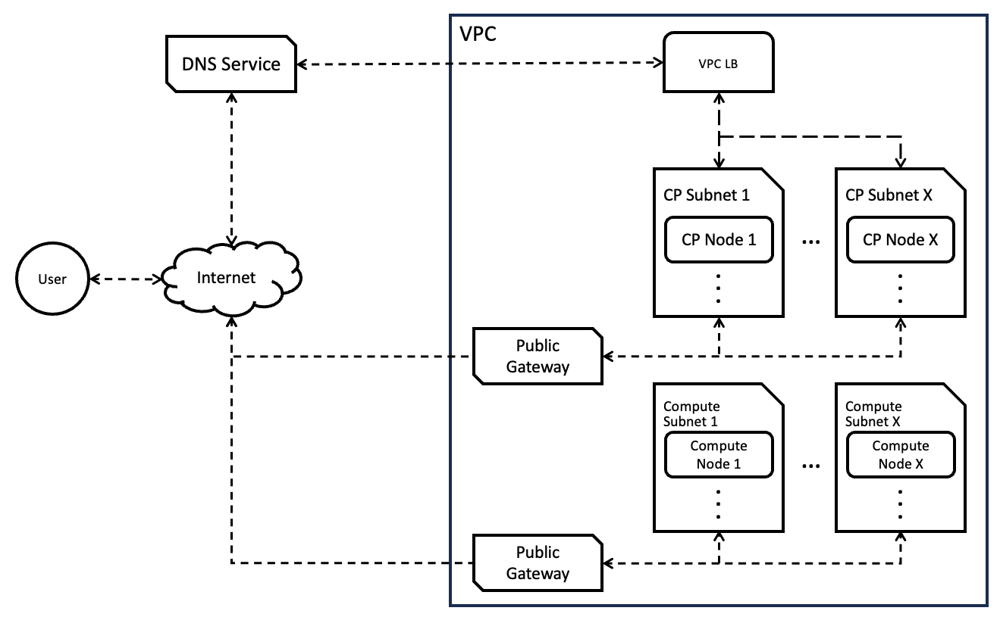
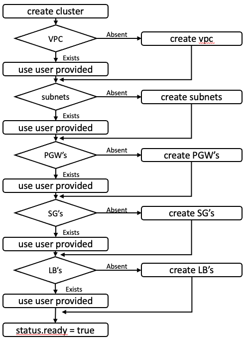
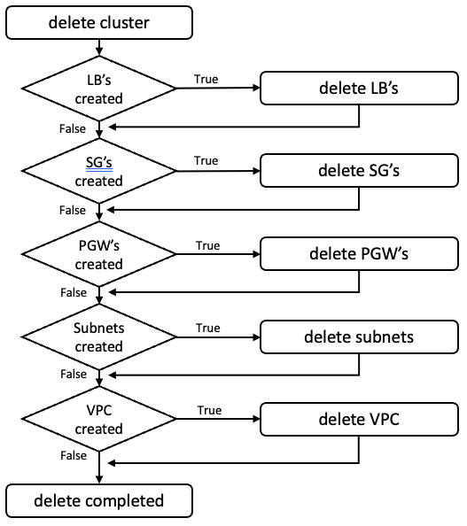

# Dynamically create infrastructure required for VPC cluster

## Motivation
Currently, cluster api will provision a series of VPC resources as
infrastructure for a cluster. However, the current process results in
restrictions in terms of availability, security, and other important
options (lack of Security Group support, single zone management, etc.).
The alternative is using existing VPC resources, which require manual
creation and configuration, although this support can still be restricted
by the current implementations (single zone or subnet).

Instead, support to grant cluster api the capabilities to deploy a wider
variety of VPC resources, with additional configurations would significantly
reduce the need to create resources as prerequisites, or be limited by the
current available configurations.


## Goal
1. Dynamically create the required cloud resources as a part of cluster
   creation, using a broader set of VPC resources and configurations.


## Proposal


### Cluster API VPC cluster components




### Proposed API changes


#### VPCCluster improvements
```go
// IBMVPCClusterSpec defines the desired state of IBMVPCCluster.
type IBMVPCClusterSpec struct {
	// Important: Run "make" to regenerate code after modifying this file

	// controlPlaneEndpoint represents the endpoint used to communicate with the control plane.
	// +optional
	ControlPlaneEndpoint capiv1beta1.APIEndpoint `json:"controlPlaneEndpoint"`

	// ControlPlaneLoadBalancer is optional configuration for customizing control plane behavior.
	// +optional
	// Deprecated: use LoadBalancers instead.
	ControlPlaneLoadBalancer *VPCLoadBalancerSpec `json:"controlPlaneLoadBalancer,omitempty"`

	// cosInstance is the IBM COS instance to use for cluster resources.
	COSInstance *CosInstance `json:"cosInstance,omitempty"`

	// loadBalancers is a set of IBM Cloud VPC Load Balancers for managing traffic to the cluster.
	LoadBalancers []VPCLoadBalancerSpec `json:"loadBalancers,omitempty"`

	// networkSpec represents the VPC network to use for the cluster.
	NetworkSpec *VPCNetworkSpec `json:"networkSpec,omitempty"`

	// region defines the IBM Cloud Region the cluster resources will be deployed in.
	Region string `json:"region"`

	// resourceGroup defines the IBM Cloud resource group where the cluster resources should be created.
	ResourceGroup string `json:"resourceGroup"`

	// The Name of VPC. 
	// Deprecated: use NetworkSpec instead.
	VPC string `json:"vpc,omitempty"`

	// The Name of availability zone.
	// Deprecated: use NetworkSpec instead.
	Zone string `json:"zone,omitempty"`
}

// VPCNetworkSpec defines the desired state of the network resources for the cluster.
type VPCNetworkSpec struct {
	// computeSubnetsSpec is a set of Subnet's which define the Compute subnets.
	ComputeSubnetsSpec []Subnet `json:"computeSubnetsSpec,omitempty"`

	// controlPlaneSubnetsSpec is a set of Subnet's which define the Control Plane subnets.
	ControlPlaneSubnetsSpec []Subnet `json:"controlPlaneSubentsSpec,omitempty"`

	// resourceGroup is the name of the Resource Group containing all of the newtork resources.
	// This can be different than the Resource Group containing the remaining cluster resources.
	ResourceGroup *string `json:"resourceGroup,omitempty"`

	// securityGroups is a set of SecurityGroup's which define the VPC Security Groups that manage traffic within and out of the VPC.
	SecurityGroups []SecurityGroup `json:"securityGroups,omitempty"`

	// vpc defines the IBM Cloud VPC.
	VPC *VPCResourceReference `json:"vpc,omitempty"`
}

// IBMVPCClusterStatus defines the observed state of IBMVPCCluster.
type IBMVPCClusterStatus struct {
	// Important: Run "make" to regenerate code after modifying this file

	// Conditions defines current service state of the load balancer.
	// +optional
	Conditions capiv1beta1.Conditions `json:"conditions,omitempty"`

	// ControlPlaneLoadBalancerState is the status of the load balancer.
	// Deprecated: rely on NetworkStatus instead.
	// +optional
	ControlPlaneLoadBalancerState *VPCLoadBalancerState `json:"controlPlaneLoadBalancerState,omitempty"`

	// COSInstance is the reference to the IBM Cloud COS Instance used for the cluster.
	COSInstance *VPCResourceReference `json:"cosInstance,omitempty"`

	// networkStatus is the status of the VPC network in its entirety resources.
	NetworkStatus *VPCNetworkStatus `json:"networkStatus,omitempty"`

	// ready is true when the provider resource is ready.
	// +kubebuilder:default=false
	Ready bool `json:"ready"`

	// resourceGroup is the reference to the IBM Cloud VPC resource group under which the resources will be created.
	ResourceGroup *ResourceReference `json:"resourceGroupID,omitempty"`

	// Deprecated: rely on NetworkStatus instead.
	Subnet Subnet `json:"subnet,omitempty"`

	// Deprecated: rely on NetworkStatus instead.
	VPC VPC `json:"vpc,omitempty"`

	// Deprecated: rely on ControlPlaneEndpoint
	VPCEndpoint VPCEndpoint `json:"vpcEndpoint,omitempty"`
}

// VPCNetworkStatus provides details on the status of VPC network resources.
type VPCNetworkStatus struct {
	// computeSubnets references the VPC Subnets for the cluster's Data Plane.
	// +optional
	ComputeSubnets []*VPCResourceReference `json:"computeSubnets,omitempty"`

	// controlPlaneSubnets references the VPC Subnets for the cluster's Control Plane.
	// +optional
	ControlPlaneSubnets []*VPCResourceReference `json:"controlPlaneSubnets,omitempty"`

	// loadBalancers references the VPC Load Balancer's for the cluster.
	// +optional
	LoadBalancers []VPCLoadBalancerStatus `json:"loadBalancers,omitempty"`

	// publicGateways references the VPC Public Gateways for the cluster.
	// +optional
	PublicGateways []*VPCResourceReference `json:"publicGateways,omitempty"`

	// securityGroups references the VPC Security Groups for the cluster.
	// +optional
	SecurityGroups []*VPCResourceReference `json:"securityGroups,omitempty"`

	// vpc references the IBM Cloud VPC.
	// +optional
	VPC *VPCResourceReference `json:"vpc,omitempty"`
}

// VPCResourceReference identifies a resource by id and type.
type VPCResourceReference struct {
	// controllerCreated indicates whether the resource is created by the CAPI controller.
	ControllerCreated bool `json:"controllerCreated,omitempty"`

	// crn defines the IBM Cloud CRN of the resource.
	CRN string `json"crn,omitempty"`

	// type defines the type of IBM Cloud resource.
	Type VPCResourceType `json:type"`
}

type VPCResourceType string

const (
	VPCResourceTypeCOS               VPCResourceType = VPCResourceType("cos")
	VPCResourceTypePublicGateway     VPCResourceType = VPCResourceType("publicgateway")
	VPCResourceTypeSecurityGroup     VPCResourceType = VPCResourceType("securitygroup")
	VPCResourceTypeSecurityGroupRule VPCResourceType = VPCResourceType("securitygrouprule")
	VPCResourceTypeSubnet            VPCResourceType = VPCResourceType("subnet")
	VPCResourceTypeVPC               VPCResourceType = VPCResourceType("vpc")
)
```


#### Share existing common resource definitions
Rather than duplicate code and also make references to existing resources
complex, we also propose relocating existing resource references into a
common file. This prevents the duplication of code in PowerVS and VPC
definitions, but also removes the direct dependence on PowerVS definitions,
placing them into a common location (preventing unexpected dependencies).

Relocate the following resource definitions in IBMPowerVSCluster
```go
// VPCResourceReference is a reference to a specific VPC resource by ID or Name
// Only one of ID or Name may be specified. Specifying more than one will result in
// a validation error.
type VPCResourceReference struct {
	// ID of resource
	// +kubebuilder:validation:MinLength=1
	// +optional
	ID *string `json:"id,omitempty"`

	// Name of resource
	// +kubebuilder:validation:MinLength=1
	// +optional
	Name *string `json:"name,omitempty"`

	// IBM Cloud VPC region
	Region *string `json:"region,omitempty"`
}

// CosInstance represents IBM Cloud COS instance.
type CosInstance struct {
	// PresignedURLDuration defines the duration for which presigned URLs are valid.
	//
	// This is used to generate presigned URLs for S3 Bucket objects, which are used by
	// control-plane and worker nodes to fetch bootstrap data.
	//
	// When enabled, the IAM instance profiles specified are not used.
	// +optional
	PresignedURLDuration *metav1.Duration `json:"presignedURLDuration,omitempty"`

	// Name defines name of IBM cloud COS instance to be created.
	// +kubebuilder:validation:MinLength:=3
	// +kubebuilder:validation:MaxLength:=63
	// +kubebuilder:validation:Pattern=`^[a-z0-9][a-z0-9.-]{1,61}[a-z0-9]$`
	Name string `json:"name,omitempty"`

	// bucketName is IBM cloud COS bucket name
	BucketName string `json:"bucketName,omitempty"`

	// bucketRegion is IBM cloud COS bucket region
	BucketRegion string `json:"bucketRegion,omitempty"`
}
```

To a shared location, such as [types.go](https://github.com/kubernetes-sigs/cluster-api-provider-ibmcloud/blob/main/api/v1beta2/types.go).

We also are adding additional resources and definitions that could be shared,
such as the following:
```go
// PortRange represents a range of ports, minimum to maximum.
type PortRange struct {
	// maximumPort is the inclusive upper range of ports.
	MaximumPort int `json:"maximumPort,omitempty"`

	// minimumPort is the inclusive lower range of ports.
	MinimumPort int `json:"minimumPort,omitempty"`
}

// SecurityGroup defines a VPC Security Group that should exist or be created within the specified VPC, with the specified Security Group Rules.
type SecurityGroup struct {
	// id of the Security Group.
	ID string

	// name of the Security Group.
	Name string
	
	// resourceGroup of the Security Group.
	ResourceGroup string

	// rules are the Security Group Rules for the Security Group.
	Rules []*SecurityGroupRule

	// tags are tags to add to the Security Group.
	Tags []string

	// vpc is the IBM Cloud VPC for the Security Group.
	VPC *VPCResourceReference
}

// SecurityGroupRule defines a VPC Security Group Rule for a specified Security Group.
type SecurityGroupRule struct {
	// action defines whether to allow or deny traffic defined by the Security Group Rule.
	Action SecurityGroupRuleAction

	// destination is a SecurityGroupRulePrototype which defines the destination of outbound traffic for the Security Group Rule.
	// Only used when Direction is SecurityGroupRuleDirectionOutbound.
	// +optional
	Destination *SecurityGroupRulePrototype

	// direction defines whether the traffic is inbound or outbound for the Security Group Rule.
	Direction SecurityGroupRuleDirection

	// securityGroupID is the ID of the Security Group for the Security Group Rule.
	SecurityGroupID *string

	// source is a SecurityGroupRulePrototype which defines the source of inbound traffic for the Security Group Rule.
	// Only used when Direction is SecurityGroupRuleDirectionInbound.
	Source *SecurityGroupRulePrototype
}

// SecurityGroupRuleRemote defines a VPC Security Group Rule's remote details.
// The type of remote defines the additional remote details where are used for defining the remote.
type SecurityGroupRuleRemote struct {
	// cidrSubnetName is the name of the VPC Subnet to retrieve the CIDR from, to use for the remote's destination/source.
	// Only used when RemoteType is SecurityGroupRuleRemoteTypeCIDR.
	// +optional
	CIDRSubnetName *string `json:"cidrSubnetName,omitempty"`

	// ip is the IP to use for the remote's destination/source.
	// Only used when RemoteType is SecurityGroupRuleRemoteTypeIP.
	// +optional
	IP *string `json:ip,omitempty"`

	// remoteType defines the type of filter to define for the remote's destination/source.
	// +required
	RemoteType SecurityGroupRuleRemoteType `json:"remoteType"`

	// securityGroupName is the name of the VPC Security Group to use for the remote's destination/source.
	// Only used when RemoteType is SecurityGroupRuleRemoteTypeSG
	// +optional
	SecurityGroupName *string `json:"securityGroupName,omitempty"`
}

// SecurityGroupRulePrototype defines a VPC Security Group Rule's traffic specifics for a series of remotes (destinations or sources).
type SecurityGroupRulePrototype struct {
	// icmpCode is the ICMP code for the Rule.
	// Only used when Protocol is SecurityGroupProtocolICMP.
	// +optional
	ICMPCode *string `json:"icmpCode,omitempty"`

	// icmpType is the ICMP type for the Rule.
	// Only used when Protocol is SecurityGroupProtocolICMP.
	// +optional
	ICMPType *string `json:"icmpType,omitempty"`

	// portRange is a PortRange allowed for the Rule's remote.
	// +optional
	PortRange *PortRange `json:"portRange,omitempty"`

	// protocol defines the traffic protocol used for the Security Group Rule.
	// +required
	Protocol SecurityGroupRuleProtocol `json:"protocol"`

	// remotes is a set of SecurityGroupRuleRemote's that define the traffic allowed by the Rule's remote.
	// Specifying multiple SecurityGroupRuleRemote's creates a unique Security Group Rule with the shared Protocol, PortRange, etc.
	// This allows for easier management of Security Group Rule's for sets of CIDR's, IP's, etc.
	Remotes []SecurityGroupRuleRemote `json:"remotes"`
}
```

#### Shared enumerations
Since IBM Cloud API's do not define enumerations for resource options, we have
added some enumerations to enforce values and for validation.
```go
type SecurityGroupRuleAction string

const (
	SecurityGroupRuleActionAllow SecurityGroupRuleAction = vpcv1.NetworkACLRuleActionAllowConst
	SecurityGroupRuleActionDeny  SecurityGroupRuleAction = vpcv1.NetworkACLRuleActionDenyConst
)

type SecurityGroupRuleDirection string

const (
	SecurityGroupRuleDirectionInbound  SecurityGroupRuleDirection = vpcv1.NetworkACLRuleDirectionInboundConst
	SecurityGroupRuleDirectionOutbound SecurityGroupRuleDirection = vpcv1.NetworkACLRuleDirectionOutboundConst
)

type SecurityGroupRuleProtocol string

const (
	SecurityGroupRuleProtocolAll  SecurityGroupRuleProtocal = vpcv1.NetworkACLRuleProtocolAllConst
	SecurityGroupRuleProtocolICMP SecurityGroupRuleProtocal = vpcv1.NetworkACLRuleProtocolIcmpConst
	SecurityGroupRuleProtocolTCP  SecurityGroupRuleProtocal = vpcv1.NetworkACLRuleProtocolTCPConst
	SecurityGroupRuleProtocolUDP  SecurityGroupRuleProtocal = vpcv1.NetworkACLRuleProtocolUDPConst
)

type SecurityGroupRuleRemoteType string

const (
	SecurityGroupRuleRemoteTypeAny  SecurityGroupRuleRemoteType = SecurityGroupRuleRemoteType("any")
	SecurityGroupRuleRemoteTypeCIDR SecurityGroupRuleRemoteType = SecurityGroupRuleRemoteType("cidr")
	SecurityGroupRuleRemoteTypeIP   SecurityGroupRuleRemoteType = SecurityGroupRuleRemoteType("ip")
	SecurityGroupRuleRemoteTypeSG   SecurityGroupRuleRemoteType = SecurityGroupRuleRemoteType("sg")
)
```


### Following resources can be created
1. [VPC](https://cloud.ibm.com/docs/vpc?topic=vpc-about-vpc)
2. [VPC Subnets](https://cloud.ibm.com/docs/vpc?topic=vpc-about-networking-for-vpc)
3. [VPC Public Gatways](https://cloud.ibm.com/docs/vpc?topic=vpc-about-networking-for-vpc#external-connectivity)
4. [VPC Security Groups](https://cloud.ibm.com/docs/vpc?topic=vpc-using-security-groups) & [VPC Security Group Rules](https://cloud.ibm.com/docs/vpc?topic=vpc-using-security-groups#defining-security-group-rules)
5. [VPC Load Balancers](https://cloud.ibm.com/docs/vpc?topic=vpc-nlb-vs-elb)


### Cluster creation workflow
The user is expected to set the annotation
`vpc.cluster.x-k8s.io/create-infra:true` on the IBMVPCCluster object to
make use of this feature. If not set, the cluster creation will proceed using
the existing process.

THe user can specify existing resources in Spec, and the specified controller
will attempt to reuse those resources instead of creating new ones.

When the resource is not set in the Spec or the provided resource name does
not exist in cloud, the controller will create a new resource.




### Cluster Deletion workflow
The controller will only delete the resources which are created by it.


