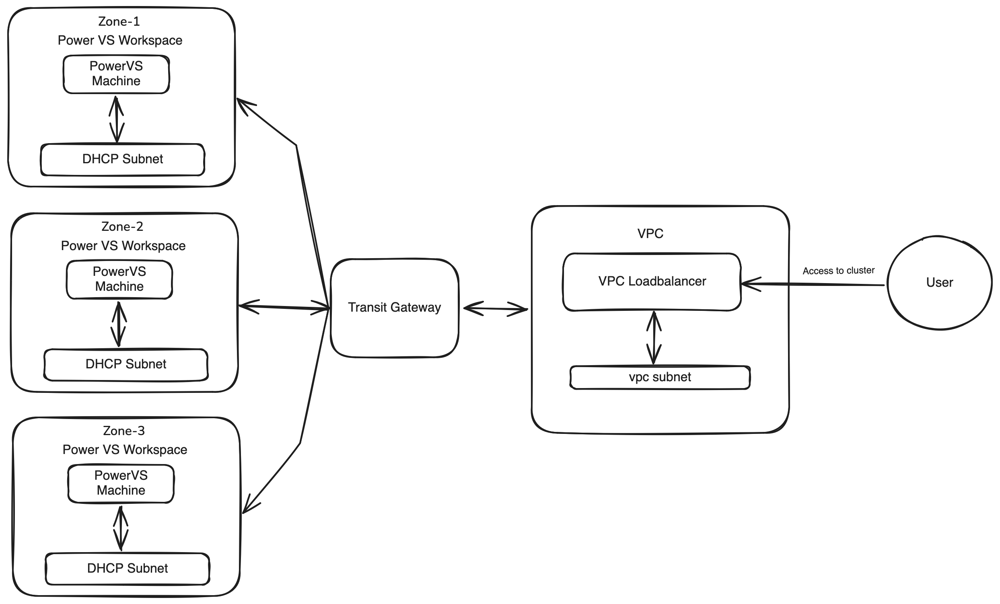

# Multiple PowerVS workspace support 

## Motivation
Currently, When a CAPIBM PowerVS cluster is created the cluster nodes are created in a single PowerVS workspace (service instance). 
Though its cost effective and easier to maintain, having support for multiple workspace will increase the availability, improve the performance and helps in 
isolating the faults.

## Goal
Support for multiple workspaces while creating PowerVS cluster

## Proposal

### PowerVS cluster with multiple workspace 



PowerVS cluster nodes are spread across multiple workspaces across different zones
which are connected to IBM Cloud VPC with the help of IBM Cloud TransitGateway.

### Proposed API changes

```shell
// IBMPowerVSClusterSpec defines the desired state of IBMPowerVSCluster.
type IBMPowerVSClusterSpec struct {
.
.
Workspaces []PowerVSWorkspace
.
.
}

// IBMPowerVSClusterStatus defines the observed state of IBMPowerVSCluster.
type IBMPowerVSClusterStatus struct {
.
.
// failureDomains specifies a list fo available availability zones that can be used.
FailureDomains clusterv1.FailureDomains `json:"failureDomains,omitempty"`
.
.
}

// IBMPowerVSClusterSpec defines the desired state of IBMPowerVSCluster.
type IBMPowerVSClusterSpec struct {
.
.
Workspaces []PowerVSWorkspace
.
.
}

//PowerVSWorkspace represent details of PowerVS Workspace(Service Instance)
type PowerVSWorkspace struct {
	// name of resource.
	// +kubebuilder:validation:MinLength=1
	// +kubebuilder:validation:MaxLength:=63
	// +kubebuilder:validation:Pattern=`^([a-zA-Z]|[a-zA-Z][-_a-zA-Z0-9]*[a-zA-Z0-9])$`
	// +optional
	Name *string `json:"name,omitempty"`
	// id of resource.
	// +optional
	ID *string `json:"id,omitempty"`
  	// zone is the name of Power VS zone of the workspace
	// possible values can be found here https://cloud.ibm.com/docs/power-iaas?topic=power-iaas-creating-power-virtual-server.
	// the zone should have PER capabilities, or else system will give error.
	// +optional
	Zone *string `json:"zone,omitempty"`
}
```

### Changes required in other projects
* cloud-provider-powervs
    
It only supports single PowerVS workspace, zone and region. This configuration is passed via [cloud-config](https://github.com/openshift/cloud-provider-powervs/blob/main/ibm/ibm.go#L121-L127).
It has to be updated to support multiple workspaces.

### Limitations

1. IBM Cloud TransitGateway supports only 5 Power Virtual Server connections