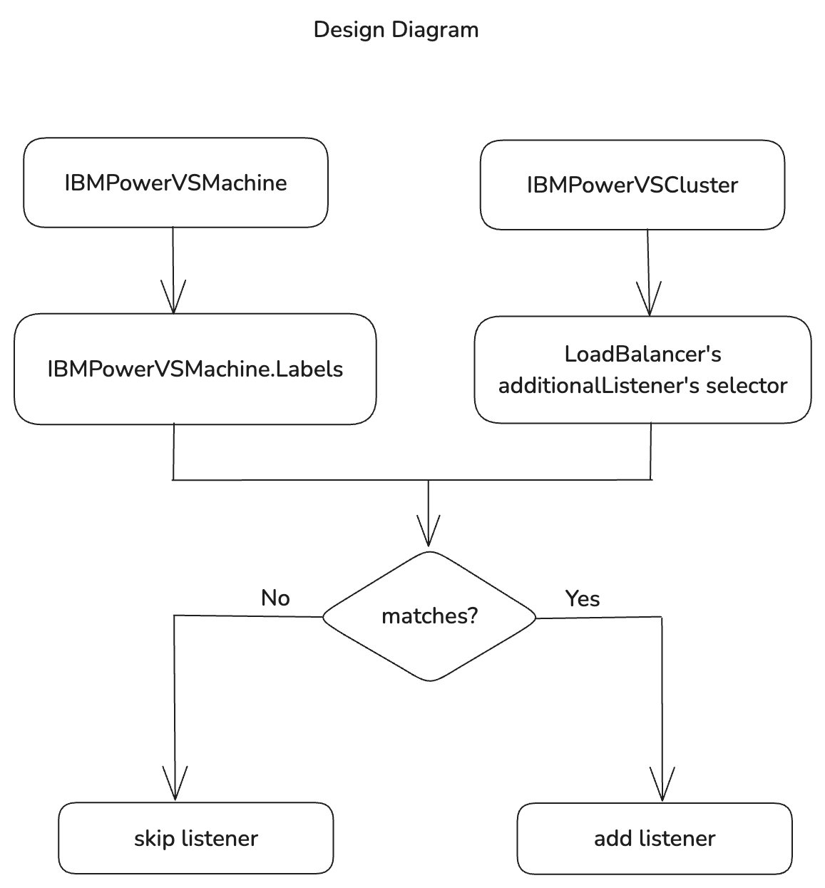
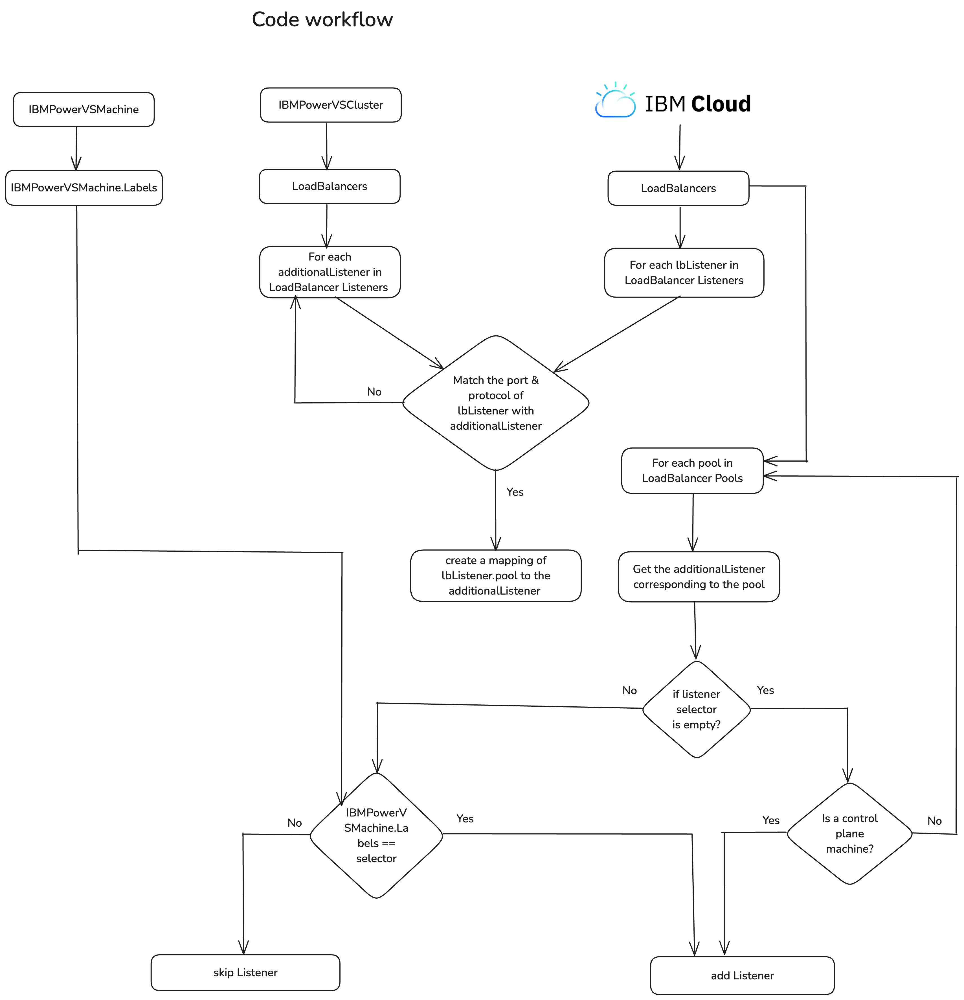

# Support configuring additional listeners to specific machines

[Github Issue](https://github.com/kubernetes-sigs/cluster-api-provider-ibmcloud/issues/1678)
## Motivation
At present, when setting up LoadBalancer's supplementary listeners, every machine within the cluster is automatically 
incorporated into the listener pool. This situation poses a challenge when attempting to activate specific ports on 
individual machines for debugging purposes. To overcome this limitation, it is advisable to introduce a feature that 
enables the assignment of listeners to particular machines.

## Goal
This proposal aims to enable the configuration of additional listeners for specific machines based on label selectors.

## Proposal

### API Changes
Both the API and controller logic require modifications.

A new `Selector` field, of type `LabelSelector`, will be added to the `AdditionalListenerSpec` to label the listener
and will be defined as follows
```go
// AdditionalListenerSpec defines the desired state of an
// additional listener on an VPC load balancer.
type AdditionalListenerSpec struct {
    // defaultPoolName defines the name of a VPC Load Balancer Backend Pool to use for the VPC Load Balancer Listener.
    // +kubebuilder:validation:MinLength:=1
    // +kubebuilder:validation:MaxLength:=63
    // +kubebuilder:validation:Pattern=`^([a-z]|[a-z][-a-z0-9]*[a-z0-9])$`
    // +optional
    DefaultPoolName *string `json:"defaultPoolName,omitempty"`

    // Port sets the port for the additional listener.
    // +kubebuilder:validation:Minimum=1
    // +kubebuilder:validation:Maximum=65535
    Port int64 `json:"port"`

    // protocol defines the protocol to use for the VPC Load Balancer Listener.
    // Will default to TCP protocol if not specified.
    // +optional
    Protocol *VPCLoadBalancerListenerProtocol `json:"protocol,omitempty"`

    // Selector is used to select the machines with same label to assign the listener
    // +kubebuilder:validation:Optional
    // +kubebuilder:validation:XValidation:rule="self == oldSelf",message="Selector is immutable"
    Selector metav1.LabelSelector `json:"selector,omitempty"`
}

```
The `LabelSelector` struct is part of [kubernetes/apimachinery](https://github.com/kubernetes/apimachinery/blob/b5eba295a2b20e0d9f72bdaeb90db91e588d2424/pkg/apis/meta/v1/types.go#L1287) repository.

A sample VPCLoadBalancerSpec with Selectors in AdditionalListenerSpec is as follows:
```yaml
# apiVersion, kind, metadata...
spec:
  name: "load-balancer-name"
  id: "loadbalancer-id"
  additionalListeners:
    - port: 22
      protocol: tcp
      selector:
        # Limitation: For now, only one machine name can be provided in the listener label selector
        matchLabels:
          infrastructure.cluster.x-k8s.io/machine-name: "bootstrap"
  # Other VPCLoadBalancerSpec fields
```
This selector value should match with the IBMPowerVSMachine `Labels` field inorder for the listener to be assigned.

A sample IBMPowerVSMachine with Labels is as follows:
```yaml
# apiVersion, kind...
metadata:
  name: "name"
  namespace: "namespace"
  labels:
    infrastructure.cluster.x-k8s.io/machine-name: "bootstrap"
spec:
  serviceInstanceID: "serviceInstance-id"
  systemType: "s922"
  # Other IBMPowerVSMachineSpec fields
```

### Controller flow

The load balancer pool member configuration is now invoked for all machines inorder to provide the ability to assign
the listeners to any machine based on the label selectors.

Iterate over the load balancer pools, obtain the corresponding pool members for each, and extract the selector from the 
listener via the default pool name. Subsequently, compare the machine label against the listener's label selector. 
Based on the comparison results, the process proceeds as follows:

    - In the event of a match, proceed with the assignment of the listener to the machine.
    - In the case of a mismatch, bypass the listener and progress to the subsequent pool member.
    - If the selector is vacant and the machine is part of the control plane, continue with the listener assignment, as all listeners can be allocated to control plane machines.

### Design


### Code Workflow


### Limitation
The current limitation of this approach is that if a listener needs to be assigned to multiple nodes, we must choose
one of the following methods:

    1. Use unique entries for each machine in the listener labels.
    2. Provide the label values as a comma-separated list.

This limitation can be resolved in the future by improving the controller flow to better handle cases where a listener
needs to be added to multiple machines.