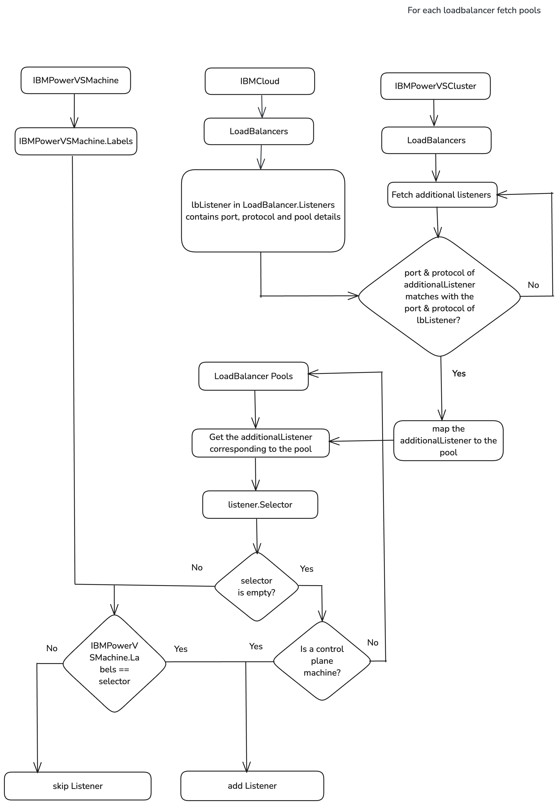

# Adding additional listeners to nodes based on the selector

[Github Issue](https://github.com/kubernetes-sigs/cluster-api-provider-ibmcloud/issues/1678)
## Motivation
Currently, when a listener pool is configured for a specific port (e.g., port 22), all machines are added to the pool.
This creates a challenge when debugging OpenShift cluster deployments, as access to the bootstrap node is necessary for
retrieving log files and other diagnostic data. Since all machines are included in the pool, SSH access to the bootstrap
node becomes impossible.
To address this, there should be a mechanism to assign listeners to specific machines using label selector matching.

## Goal
This proposal aims at providing the ability to configure additional listeners to specific machines based on label
selectors.

## Proposal

### API Changes
Both the API and controller logic require modifications.

A new `Selector` field, of type `LabelSelector`, will be added to the `AdditionalListenerSpec` to label the listener
and will be defined as follows
```go
// AdditionalListenerSpec defines the desired state of an
// additional listener on an VPC load balancer.
type AdditionalListenerSpec struct {
    // defaultPoolName defines the name of a VPC Load Balancer Backend Pool to use for the VPC Load Balancer Listener.
    // +kubebuilder:validation:MinLength:=1
    // +kubebuilder:validation:MaxLength:=63
    // +kubebuilder:validation:Pattern=`^([a-z]|[a-z][-a-z0-9]*[a-z0-9])$`
    // +optional
    DefaultPoolName *string `json:"defaultPoolName,omitempty"`

    // Port sets the port for the additional listener.
    // +kubebuilder:validation:Minimum=1
    // +kubebuilder:validation:Maximum=65535
    Port int64 `json:"port"`

    // protocol defines the protocol to use for the VPC Load Balancer Listener.
    // Will default to TCP protocol if not specified.
    // +optional
    Protocol *VPCLoadBalancerListenerProtocol `json:"protocol,omitempty"`

    // Selector is used to select the machines with same label to assign the listener
    // +kubebuilder:validation:Optional
    // +kubebuilder:validation:XValidation:rule="self == oldSelf",message="Selector is immutable"
    Selector metav1.LabelSelector `json:"selector,omitempty"`
}

```
The `LabelSelector` struct is part of [kubernetes/apimachinery](https://github.com/kubernetes/apimachinery/blob/master/pkg/apis/meta/v1/types.go#L1287) repository.

A sample VPCLoadBalancerSpec with Selectors in AdditionalListenerSpec is as follows:
```yaml
# apiVersion, kind, metadata...
spec:
  name: "load-balancer-name"
  id: "loadbalancer-id"
  additionalListeners:
    - port: 22
      protocol: tcp
      selector:
        # Limitation: For now, only one machine name can be provided in the listener label selector
        matchLabels:
          infrastructure.cluster.x-k8s.io/machine-name: "bootstrap"
  # Other VPCLoadBalancerSpec fields
```
This selector value should match with the IBMPowerVSMachine `Labels` field inorder for the listener to be assigned.

A sample IBMPowerVSMachine with Labels is as follows:
```yaml
# apiVersion, kind...
metadata:
  name: "name"
  namespace: "namespace"
  labels:
    infrastructure.cluster.x-k8s.io/machine-name: "bootstrap"
spec:
  serviceInstanceID: "serviceInstance-id"
  systemType: "s922"
  # Other IBMPowerVSMachineSpec fields
```

### Controller flow

The load balancer pool member configuration is now invoked for all machines inorder to provide the ability to assign
the listeners to any machine based on the label selectors.

The load balancer details are retrieved from the IBMPowerVSCluster.Spec.LoadBalancers. If no load balancers are
specified in the Spec, the load balancer details are generated based on the IBMPowerVSCluster name.
Loop through the load balancers, check the status of the IBMPowerVSCluster, and verify the load balancer's
provisioning status. Proceed only if the status is Active and it contains backend pools.
Loop through the load balancer pools, retrieve the associated pool members for each, and then verify the label selector
specified in the listener.

    - If the selector matches, continue with adding the listener to the machine.
    - If it doesn't match, skip the listener and move on to the next pool member.
    - If the selector is empty and the machine is a control plane, continue to add the listener, since all listeners
    can be assigned to control plane machines.

### Workflow


### Limitation
The current limitation of this approach is that if a listener needs to be assigned to multiple nodes, we must choose
one of the following methods:

    1. Use unique keys for each machine in the listener labels.
    2. Provide machine names as a comma-separated list.

This limitation can be resolved in the future by improving the controller flow to better handle cases where a listener
needs to be added to multiple machines.