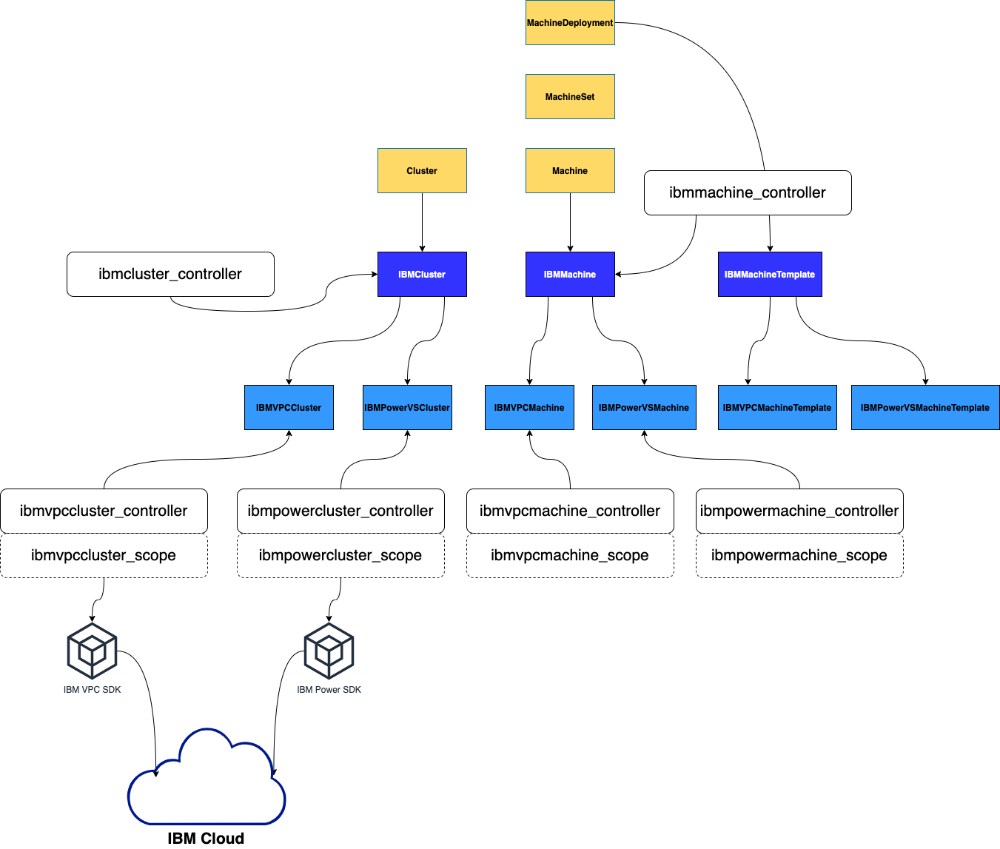
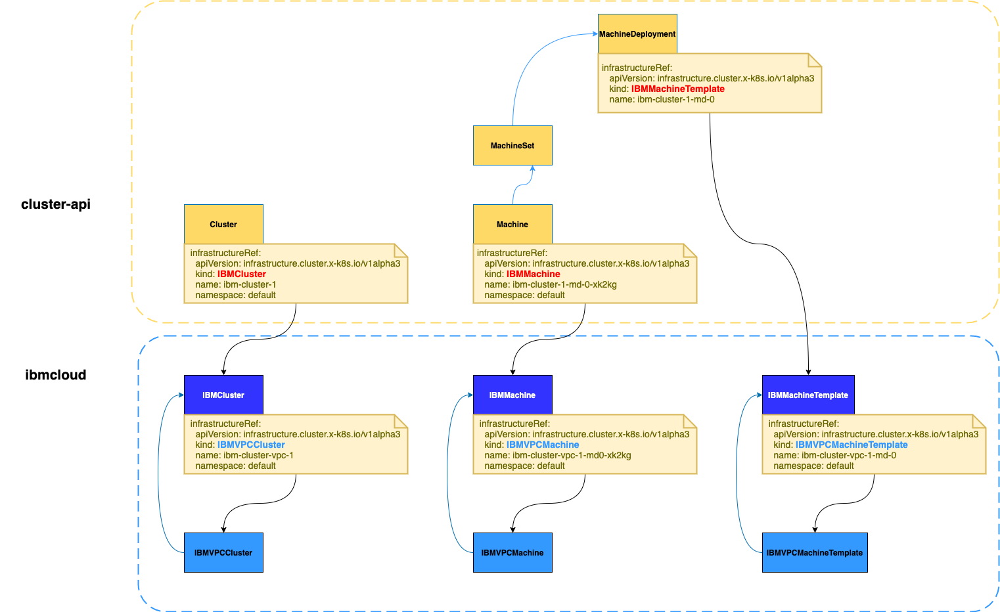
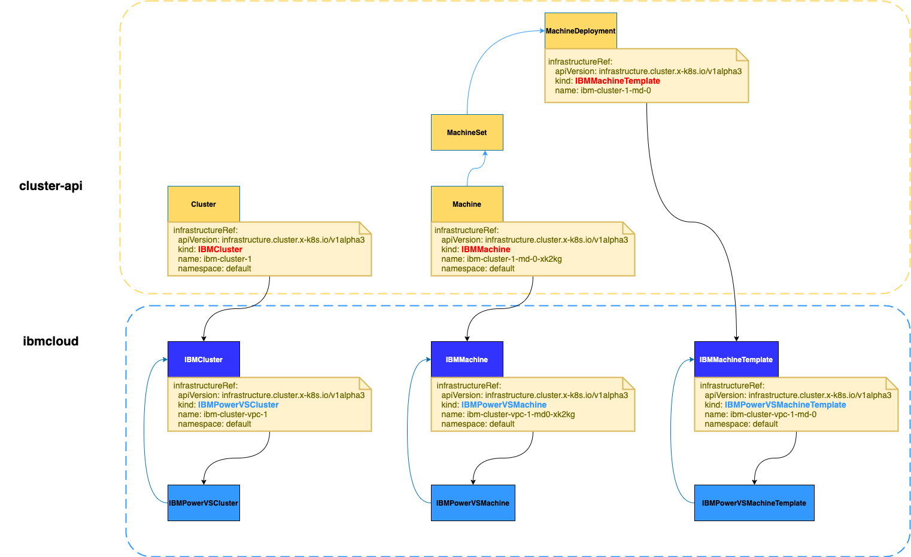

# IBM Cloud Provider with multiple types of IaaS

## Motivation

There are multiple types of IaaS in IBM Cloud: Classic infrastructure, VPC and PowerVS etc. Each type of IaaS has some specific features. Users would like to bootstrap a k8s cluster from any types of IaaS. It's hard to maintain an individual repository for each type of IaaS. A good implementation should describe IBM Cloud feature in an appropriate grain. 

## Proposal

This proposal presents a 2 layers infrastructure resource definition. Th top layer describes IBM Cloud common feature and the 2nd layer describes the details of the specific IaaS implementation.

IBMCluster/IBMMachine/IBMMachineTemplate is the generic top layer. It would only show the required information to reconsile status with cluster-api level Objects. Cluster, Machine and MachineDeployment etc. It doesn't know that VPC infrastructure would care about subnet details, public gateways, security groups. And it also doesn't care about PowerVS needs CloudInstance.

We borrowed the `infrastructureRef` concept from cluster-api level Object. An IBMCluster should reference a specific IaaS implementation. Using VPC as an example we have an individual `IBMVPCCluster` object which has all the details that are needed in IBM Cloud VPC. There is also a specific ibmvpccluster_controller to watch the `IBMVPCCluster` and manuplate the VPC, subnet, security group and public gateway. They are all VPC resouces.
Similarly `IBMVPCMachine` stands for compute instance in VPC scope. You can specify image id, ssh key and subnet for the compute instance which would be used as control plane or worker nodes. The ibmvpcmachine_controller can manuplate the compute in VPC world. Both controllers work through vpc sdk.

If user need to bootstrap k8s from PowerVS. The implementation is similar.

## Benefit of this design

### Unifined IaaS resource definition for cluster-api

Actually the top level Object is things like cluster-api object in IBM Cloud. Cluster api intends to provide an abstract definition for different types of cloud-providers. IBMCluster intends to provide abstract definition for different types of IaaS implementation in IBM Cloud. Owner reference and infrastructureRef relation ship can be established as cluster-api object and provider object.

### Decouple specific IaaS details

It is easy to extend the IaaS family. 