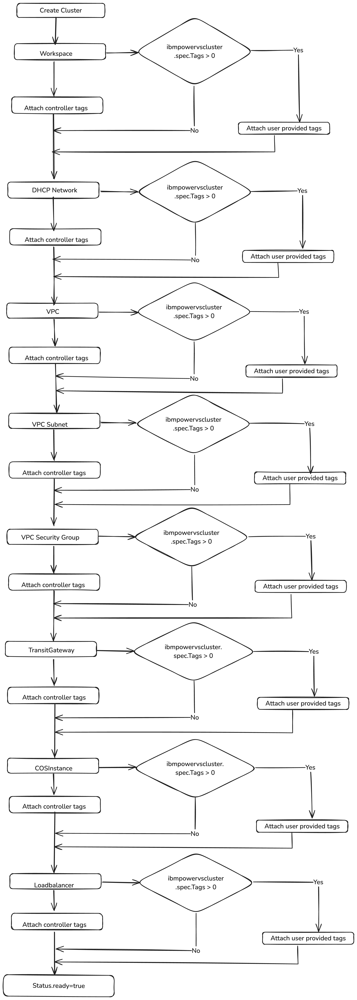
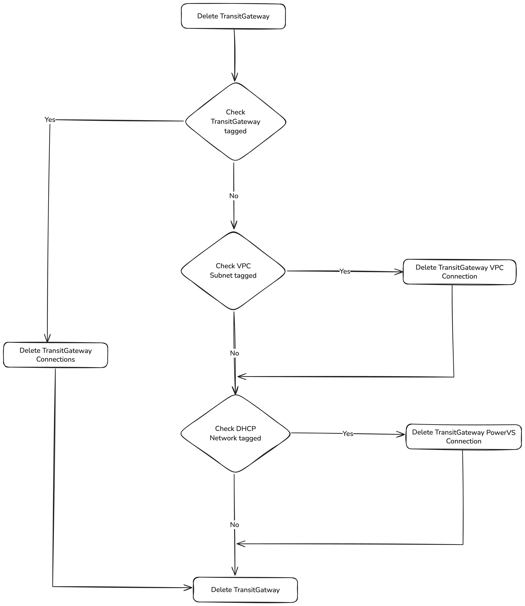

# Tagging PowerVS cluster resources for lifecycle management


## Motivation
PowerVS cluster creation supports both creating infrastructure and using existing resources required for cluster creation.
PowerVS cluster reconciler sets [controllerCreated](https://github.com/kubernetes-sigs/cluster-api-provider-ibmcloud/blob/48aebb99c3cd8ce65b95dcfceee8f52daf3d5a31/api/v1beta2/ibmpowervscluster_types.go#L181) field whenever resource is created by controller, which was initially introduced to allow proper cleanup of newly created resource vs the use of existing resources. ControllerCreated field will be set for respective resource under ibmpowervscluster.status

Though its working as expected and fulfills the purpose, we see some drawbacks.
1. The field is initially set to true during the first reconciliation cycle when the resource is being created. In subsequent reconciliation loops, the field is not updated because the resource already exists in the cloud(created during first reconciliation). This behavior introduces non-idempotency in the controller logic. As a result, if the initial reconciliation event is missed, the controller exhibits inconsistent behavior. Its against Kubernetes principle of reconciliation of having level trigger rather than edge triggered.
2. The Status subresource in a resource object is expected to be created from spec, considering the scenario of backup and recover. If we move the spec to fresh management cluster which is setting the status, the controller created will be set as false as the resource already exists in cloud but it was created during its previous reconciliation.

## Goal
1. Tag newly created PowerVS Cluster's cloud resources and delete the resources based on tag.
2. Provide ability to set custom tags to cloud resources.

## Non-Goals
1. Deprecate and remove controllerCreated flag.
2. Tag user provided resources.

## Proposal
This proposal presents adding two kinds of tags to the resources created by controller
1. Controller tag
2. User tags


### Controller tag
A tag of format`powervs.cluster.x-k8s.io-resource-owner:<cluster_name>` will be added by the controller to newly created cloud resources marking the resource as created by controller. During deletion phase the system will look for the presence of the tag inorder to proceed with deletion or to keep as it is.


#### Following resources will be getting tagged 
1. [PowerVS workspace](https://cloud.ibm.com/docs/power-iaas?topic=power-iaas-creating-power-virtual-server)
2. [PowerVS Network](https://cloud.ibm.com/docs/power-iaas?topic=power-iaas-configuring-subnet) [DHCP server]
3. [VPC](https://cloud.ibm.com/docs/vpc?topic=vpc-about-vpc)
4. [VPC Subnet](https://cloud.ibm.com/docs/vpc?topic=vpc-about-networking-for-vpc)
5. [VPC Security Groups](https://cloud.ibm.com/docs/vpc?topic=vpc-security-in-your-vpc)
6. [Transit Gateway](https://www.ibm.com/products/transit-gateway)
7. [VPC Loadbalancer](https://www.ibm.com/products/load-balancer)
8. [COS Instance](https://www.ibm.com/products/cloud-object-storage)

#### Note 
- When TransitGateway is tagged we can delete connections. But there is case when TransitGateway is not newly created but connections are newly created. But we connot delete connections since it doesn't support tagging. So to delete VPC connection have to check VPC subnet is tagged and to delete PowerVS connection have to check DHCP network is tagged.
- To handle deletion DHCP server, have to tag DHCP Network. DHCP server doesn't support tagging.

### User tags
User can add tags to resources when creating PowerVS cluster.

#### Proposed API changes
UserTags field will contain list of tags that will be attached to resources.

```shell

// IBMPowerVSClusterSpec defines the desired state of IBMPowerVSCluster.
type IBMPowerVSClusterSpec struct {

	// Tags contains list of tags needs to be attached to resources
	Tags []Tag `json:"tags,omitempty"`
	.
	.
	.	
	
}

// Tag defines single tag in pair
type Tag struct {
	Key string  `json:"key,omitempty"`
	Value string `json:"value,omitempty"`
}

```


### Cluster creation workflow
 1. The controller will attach the `powervs.cluster.x-k8s.io-resource-owner:<cluster_name>` tag to the created resources.
 2. If user tags are set in the spec, they will be attached to the resources. 



### Cluster Deletion workflow
The controller will only delete the resources which are having this tag `powervs.cluster.x-k8s.io-resource-owner:<cluster_name>` attched to it.


#### TransitGatway Deletion workflow
This provides detailed flow how TransitGateway and TransitGateway Connections will be deleted.
