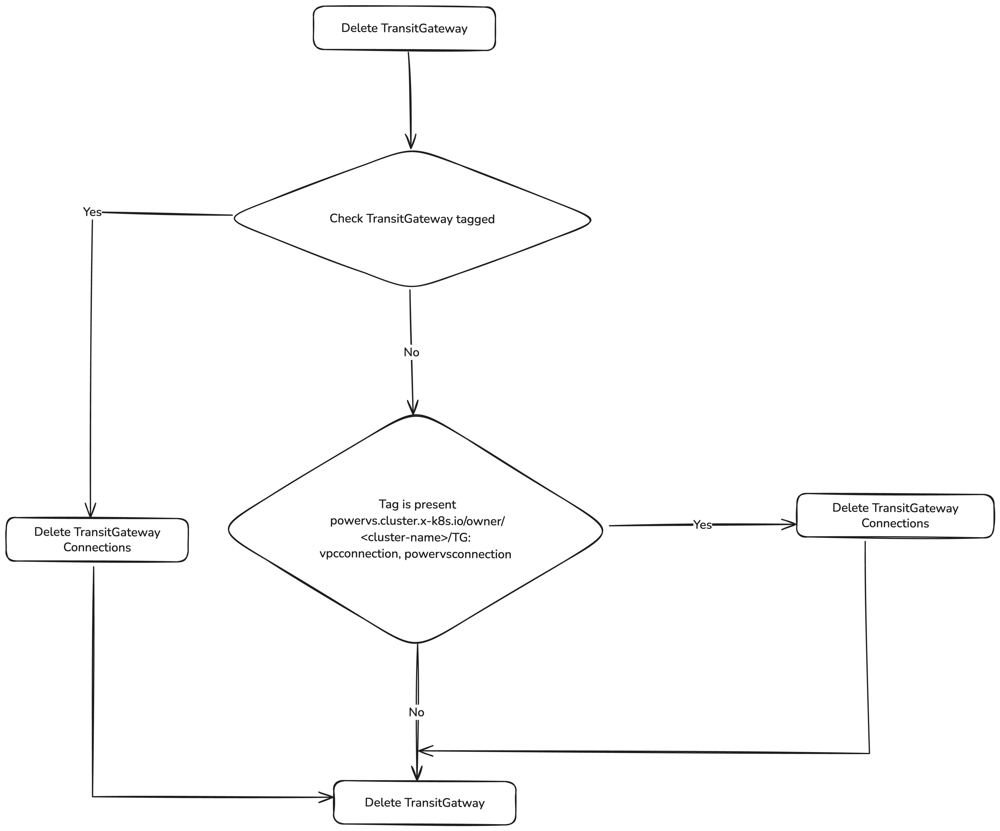

# Tagging PowerVS cluster resources for lifecycle management


## Motivation
PowerVS cluster creation supports both creating infrastructure and using existing resources required for cluster creation.
PowerVS cluster reconciler sets [controllerCreated](https://github.com/kubernetes-sigs/cluster-api-provider-ibmcloud/blob/48aebb99c3cd8ce65b95dcfceee8f52daf3d5a31/api/v1beta2/ibmpowervscluster_types.go#L181) field whenever resource is created by controller, which was initially introduced to allow proper cleanup of newly created resources. ControllerCreated field will be set for respective resources under `IBMPowerVSCluster.Status`.

Though its working as expected and fulfills the purpose, we see some drawbacks.
1. The field is initially set to true during the first reconciliation cycle when the resource is being created. In subsequent reconciliation loops, the field is not updated because the resource already exists in the cloud(created during first reconciliation). This behavior introduces non-idempotency in the controller logic. As a result, if the initial reconciliation event is missed, the controller exhibits inconsistent behavior. Its against Kubernetes principle of reconciliation of having level trigger rather than edge triggered.
2. The Status field in resource object gets created from spec. Considering the scenario of backup and recover, if we move the spec to fresh management cluster which is setting the status, the ControllerCreated will be set as false as the resource already exists in cloud but it was created during its previous reconciliation.

## Goal
1. Tag newly created PowerVS Cluster's cloud resources and delete the resources based on tag.
2. Provide ability to set custom tags to cloud resources.

## Non-Goals
1. Deprecate and remove controllerCreated flag.
2. Tag user provided resources.

## Proposal
This proposal presents adding two kinds of tags to the resources created by controller
1. Controller tags
2. User tags


### Controller tags
 When cluster creation is triggered, resources gets created in the cloud. So to distinguish whether resources are newly created or user has given pre-existing resources,
 tag of format `powervs.cluster.x-k8s.io/cluster-uuid: UUID` will be added by the controller to newly created cloud resources marking the resource as created by controller.
 During cluster creation with infrastructure creation if the resources are already present with the same name in the cloud. It will lead to security issues because there is a possibilty the existing resources in the cloud belong to different user. So to handle this scenario tag of this `powervs.cluster.x-k8s.io/cluster-uuid: UUID` is added. UUID in tag `powervs.cluster.x-k8s.io/cluster-uuid: UUID` represents cluster object ID.
 
 During deletion phase the system will look for the presence of the tag and match inorder to proceed with deletion or to keep as it is. 

 Below are the cluster creation scenarios.
 #### Creating a new cluster 
 - When resources will be created for new cluster in the cloud the tag will be attached. During deletion flow, will check for tag `powervs.cluster.x-k8s.io/cluster-uuid: UUID` and delete the resources.
 #### Creating a new cluster with reusing pre-created resources
 - When cluster is created using existing resources, no tag will be attached. We won't delete these resources, as these were not created by controller.
 #### Creating a new cluster with reusing pre-created resources from old cluster.
 - When cluster creation is triggered with clustername "test-cluster", resources like "test-cluster-serviceInstance, test-cluster-VPC, test-cluster-loadbalancer, test-cluster-TransitGateway, test-cluster-COSInstance" are created. When trying to create the resources in the cloud, since the resources already exists with same name but tag `powervs.cluster.x-k8s.io/cluster-uuid: UUID` won't match because UUIDs of cluster objects will be different. So in this case will error out to user that resources with similar name already exist, user has to provide different name to cluster.


#### Following resources will be getting tagged 
1. [PowerVS workspace](https://cloud.ibm.com/docs/power-iaas?topic=power-iaas-creating-power-virtual-server)
2. [PowerVS Network](https://cloud.ibm.com/docs/power-iaas?topic=power-iaas-configuring-subnet) [DHCP server]
3. [VPC](https://cloud.ibm.com/docs/vpc?topic=vpc-about-vpc)
4. [VPC Subnet](https://cloud.ibm.com/docs/vpc?topic=vpc-about-networking-for-vpc)
5. [VPC Security Groups](https://cloud.ibm.com/docs/vpc?topic=vpc-security-in-your-vpc)
6. [Transit Gateway](https://www.ibm.com/products/transit-gateway)
7. [VPC Loadbalancer](https://www.ibm.com/products/load-balancer)
8. [COS Instance](https://www.ibm.com/products/cloud-object-storage)

#### Note 
- When TransitGateway is tagged we can delete connections. But there is case when TransitGateway is not newly created but connections are newly created. But we cannot delete connections since it doesn't support tagging. So to delete TransitGateway connections have to add tag `powervs.cluster.x-k8s.io/owner/<cluster-name>/TG: vpcconnection, powervsconnection` to TransitGateway. So will check if this tag is added to TransitGateway, will move with the deletion of connections.

- To handle deletion DHCP server, have to tag DHCP Network. DHCP server doesn't support tagging.

### User tags
User can add tags to resources when creating PowerVS cluster. Incase of already existing resources, will just attach the user tags and during deletion user tags will be deleted as well.

#### Proposed API changes
UserTags field will contain list of tags that will be attached to resources.

```shell

// IBMPowerVSClusterSpec defines the desired state of IBMPowerVSCluster.
type IBMPowerVSClusterSpec struct {

	// Tags contains list of tags needs to be attached to resources
	Tags []Tag `json:"tags,omitempty"`
	.
	.
	.	
	
}

// Tag defines single tag in pair
type Tag struct {
	Key string  `json:"key,omitempty"`
	Value string `json:"value,omitempty"`
}

```


### Cluster creation workflow
 1. The controller will attach the `powervs.cluster.x-k8s.io/cluster-uuid: UUID` tag to the created resources.
 2. If user tags are set in the spec, they will be attached to the resources. 
 In diagram resources represents all the cloud resources that will be created during cluster creation.For all the resources similar follow will be followed.


### Cluster Deletion workflow
The controller will only delete the resources which are having tag `powervs.cluster.x-k8s.io/cluster-uuid: UUID` attached to it.


#### TransitGatway Deletion workflow
This provides detailed flow how TransitGateway and TransitGateway Connections will be deleted.
